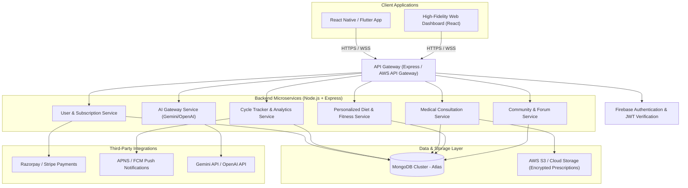

# HerCare AI - System Architecture & Security Specification

This document details the high-level system architecture, deployment strategy, and HIPAA-inspired security model for the **HerCare AI** platform.

---

## 1. High-Level System Architecture

HerCare AI is designed as a secure, distributed, mobile-first cloud application. The mobile clients communicate with a scalable RESTful API Gateway, which forwards requests to core Node.js/Express services and coordinates AI workflows and third-party integrations.

### Components Breakdown:
1. **Frontend Mobile Client (React Native / Flutter)**: Operates on iOS and Android devices, securely storing local offline session keys, cycle data (via encrypted SQLite/Keystore), and communicating with the API via TLS 1.3.
2. **API Gateway**: Provides rate limiting, routing, CORS management, and token verification.
3. **Core Services (Node.js + Express)**: Modular backend services configured horizontally, running inside Docker containers on AWS ECS or Google Cloud Run.
4. **AI Gateway**: Interface layer mapping structured user symptoms and prompts, validating inputs, appending strict medical disclaimers, and sanitizing LLM responses before passing them back to the user.
5. **MongoDB Atlas Database**: Primary data store using MongoDB Atlas with AWS VPC peering, configured with data-at-rest encryption.
6. **AWS S3 / Firebase Storage**: Encrypted document storage for uploaded lab reports, medical scans, and doctor prescriptions.

---

## 2. Security & HIPAA-Inspired Privacy Framework

Women's health data is highly sensitive. HerCare AI is designed to meet strict security and privacy standards (similar to HIPAA in the US and GDPR/DPDP requirements internationally).

### A. End-to-End Chat Encryption (E2EE)
All doctor-patient text and video consultations are fully encrypted to prevent unauthorized access.
- **Protocol**: Chat messages are encrypted using the Double Ratchet Algorithm (Signal Protocol).
- **Key Exchange**: Ephemeral Diffie-Hellman keys are generated on-device during session setup.
- **Consultation Storage**: Encrypted messages are stored in MongoDB as ciphertext blocks. The backend server acts only as a relay and holds no decryption keys; decryption occurs strictly on authorized patient and doctor client devices.

### B. Secure Medical Record Storage (AES-256)
- **At Rest**: Files uploaded to AWS S3 (e.g., blood test reports, prescriptions) are encrypted on the client side before upload using AES-256-GCM.
- **In Transit**: All communication channels require TLS 1.3, blocking legacy, insecure cryptographic protocols.
- **Access Control**: S3 buckets are private. Files are served using securely signed, single-use, time-limited URLs (valid for 5 minutes maximum) issued only to authenticated and authorized participants.

### C. HIPAA Compliance Checklist
| Requirement | HerCare AI Technical Implementation |
| :--- | :--- |
| **Access Control** | PIN/Biometric lock on mobile app; Firebase Auth with MFA for doctor portals. |
| **Audit Controls** | All user and medical access actions are logged with immutable, write-once logs in AWS CloudWatch. |
| **Data Integrity** | Cryptographic hash checks (SHA-256) verify that prescriptions and medical logs are unaltered. |
| **Transmission Security** | HTTPS TLS 1.3 enforced globally. Zero plaintext communication. |
| **Consent Management** | Explicit, granular opt-in checkouts before logging cycles or asking AI health questions. |

---

## 3. DevOps, CI/CD, and Hosting Blueprint

- **Development Platform**: Expo (React Native) for cross-platform app deployment.
- **Hosting Environment**:
  - **Frontend Staging/Production**: Netlify/Vercel (for the web prototype) and Google Play / Apple App Store (for mobile clients).
  - **Backend APIs**: AWS ECS (Fargate) for serverless container workloads.
- **Database**: MongoDB Atlas M2 Tier (with continuous automated backups and region-replication).
- **CI/CD Pipeline**: GitHub Actions workflows for running Jest testing scripts, static linting checks, and automatic deployments to staging environments upon successful master branch merges.
